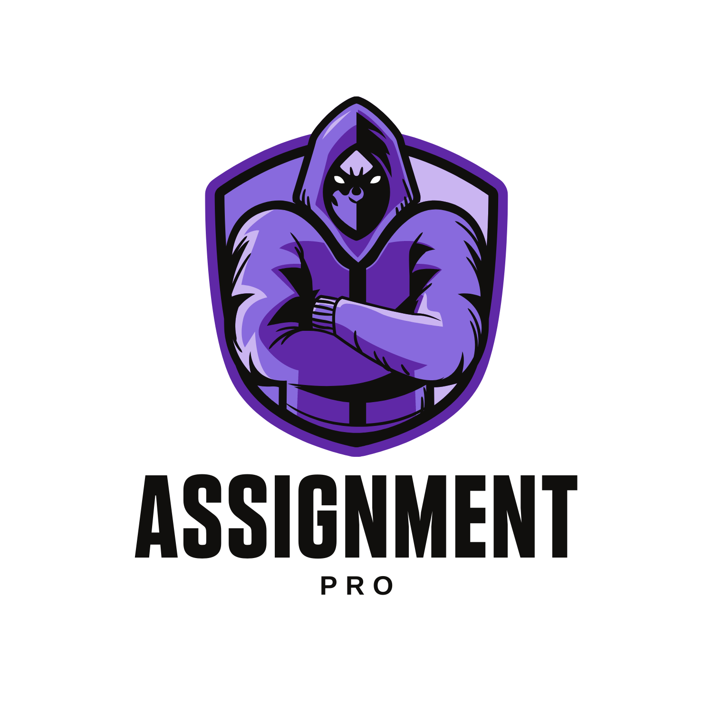

# Our Idea and objective

Every college student have to write assignments and files in every semester and it is a time-consuming task which can be used for other useful tasks like learning new language or doing some other hobby than writing same thing and not learning any thing!
There are many OCR out there which can scan your document and give you text which you can copy paste and there are many assignment makers which take text and convert to handwriting like [Text to Handwriting](https://saurabhdaware.github.io/text-to-handwriting/) 
But all of these projects lack basic functionality which will be covered here:

1. OCR of handwriting:
  - There is always written source provided by our friends, seniors and teachers which is tough to OCR by any software out there!
  - Special characters are not OCR correctly and thus needs to be manually added!
2. Natural Writing/font:
  - When you write an assignment/file there are mistakes, change of font as you write pages (Usually starting pages are in very good font and then handwriting gradually detoriates!)
  - In handwriting special characters are not identical as fonts and need to be used as natural one.
3. Placement of text:
  - After OCR automatic placement of text.
4. Sheet of Paper:
  - Natural scans of paper is required with different combinations. 
    - Ruled / non-ruled.
    - In different lighting conditions.
    - Different notebooks, files, pages.
    
All this is required to overcome the problems which are present in other solutions.
This repo will be divided in 2 sections - SOFTWARE and HARDWARE.

# Software

To start with such application we need a frontend and backend.

## Front-End
Frontend of choice is react, which can be run on multiple platforms without any hassle and provide all modular designs required for a frontend.

## Back-End
Backend of choice is python, which will utilise multiple structures such as openCV and other modules which will be helpful in completing the task.

# Hardware

If you want to go extra step and make a machine to write assignment/file for you then it is your destination which uses PNP type of approach and hence utilise software part to do the magic!
